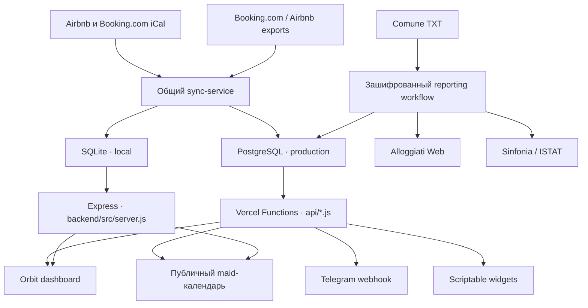

# Atrani Booking Manager

Система управления бронированиями, уборками и гостевой отчётностью для объектов краткосрочной аренды в Атрани. Она объединяет календари Airbnb и Booking.com, показывает загрузку объектов, создаёт задачи на уборку, помогает вести туристический налог и готовить отправки в Alloggiati Web и ISTAT.

**Production:** [b.amalfi.day](https://b.amalfi.day)<br>
**Текущая версия продукта:** **Design 2.0 / Orbit**<br>
**Каноническая ветка:** `main`

Административный интерфейс работает на русском языке. Публичный календарь уборщицы — на итальянском.

> `main` — единственный источник production-кода. Исторические ветки с `design2.0` в имени и старые инструкции по Docker/Vercel не используются как база для разработки. Граница релиза описана в [BASELINE.md](BASELINE.md), обязательный workflow — в [CONTRIBUTING.md](CONTRIBUTING.md).

## Что умеет система

- синхронизирует 15 iCal-фидов Airbnb и Booking.com для 11 объектов;
- валидирует полный inventory фидов, повторяет временно упавшие запросы и не запускает две синхронизации одновременно;
- показывает бронирования на desktop timeline и в облегчённой мобильной agenda;
- отличает реальные брони от технических `CLOSED` / `Not available` маркеров Booking.com;
- мягко архивирует пропавшие брони и производные уборки вместо физического удаления;
- автоматически создаёт задачи на уборку на дату выезда;
- хранит назначения уборщиц и публикует персональные ссылки `/maid/:slug`;
- строит сезонную статистику и сохраняет ежедневные snapshots;
- ведёт отметки об оплате туристического налога;
- импортирует Comune TXT, сопоставляет гостей с бронями, выполняет Alloggiati `Test` / `Send`, хранит квитанции и формирует месячный ISTAT ledger;
- показывает отдельный архив гостевых отправок с фильтрами, карточками, подробностями и квитанциями;
- отправляет сводки через Telegram webhook или отдельный polling-бот;
- отдаёт защищённые данные для Scriptable-виджетов iPhone;
- контролирует доступ через Cloudflare Access и скрывает production-админку на прямом домене Vercel;
- поддерживает системную, дневную и ночную темы. Выбор сохраняется между разделами и сессиями.

## Разделы интерфейса

| Маршрут | Назначение | Доступ | Язык |
|---|---|---|---|
| `/` | Календарь, ближайшие заезды и выезды, синхронизация | администратор | русский |
| `/maid` | Уборщицы, объекты и публичные slug-ссылки | администратор | русский |
| `/stats` | Сезонная аналитика и история показателей | администратор | русский |
| `/tax` | Туристический налог по датам и броням | администратор | русский |
| `/reporting` | Comune TXT, Alloggiati, квитанции и ISTAT | администратор | русский |
| `/maid/:slug` | Заезды и выезды по объектам конкретной уборщицы | публичный | итальянский |
| `/health` | Состояние БД и свежесть календарей | публичный, без деталей фидов | JSON |

Основные административные маршруты обслуживаются одним файлом `frontend/public/index.html`: URL определяет активную вкладку, а `history.pushState` обновляет адрес без перезагрузки. Публичный maid-календарь — отдельная mobile-first страница `frontend/public/maid.html`.

## Как движутся данные



### Жизненный цикл синхронизации

1. Конфигурация загружается из `ICAL_URLS` в production или из приватного `backend/config/calendars.json` локально.
2. `backend/config/calendar-inventory.json` проверяет, что присутствуют все обязательные объекты и платформы. Неполная конфигурация завершает sync явной ошибкой.
3. Каждый фид загружается с настраиваемым timeout и retry, затем разбирается через `ical.js`.
4. Система извлекает даты, имя гостя, страну, ссылку брони и тип события. Технические маркеры недоступности нормализуются отдельно от реальных броней.
5. Брони upsert-ятся в БД. Исчезнувшая запись сначала получает `missing_since` и только после grace period становится `active = false`; физического удаления нет.
6. На реальные выезды создаются уборки. Производные задачи без активного checkout также мягко архивируются.
7. При наличии локальных экспортов выполняется дополнительное enrichment Booking.com/Airbnb.
8. В конце сохраняются результат запуска в `sync_runs`, snapshot статистики и данные для `/health`.

PostgreSQL использует advisory transaction lock, а процесс дополнительно держит in-memory lock. Параллельный запрос получает `409 SYNC_IN_PROGRESS`. Все календарные даты и пользовательские «сегодня/завтра» рассчитываются в `Europe/Rome`.

### Когда запускается sync

- GitHub Actions `monitor-sync`: в `:07` и `:37` каждого часа;
- Vercel Cron: ежедневно в `06:00 UTC` как резервный запуск;
- Vercel Cron reporting maintenance: ежедневно в `06:30 UTC` забирает квитанции и очищает просроченные PII;
- открытая production-админка: при входе, возврате на вкладку и не чаще одного раза в пять минут;
- вручную: кнопкой в интерфейсе, `POST /api/sync` или `npm run sync` локально.

Preview deployment не запускает calendar sync, потому что preview может использовать общую production-БД, но намеренно не получает production `ICAL_URLS`.

## Объекты

| ID | Название | Фиды | Группа интерфейса |
|---|---|---|---|
| `vingtage` | Vingtage Room | Airbnb + Booking.com | Dragone |
| `orange` | Orange Room | Airbnb + Booking.com | Dragone |
| `solo` | Solo Room | Airbnb + Booking.com | Dragone |
| `youth` | Youth Room | Airbnb + Booking.com | Dragone |
| `central` | Central Room | Booking.com | Dragone |
| `awesome` | Awesome Apartments | Airbnb | Dragone |
| `carina` | Carina | Airbnb | Dipino |
| `harmony` | Harmony | Airbnb | Dipino |
| `royal` | Royal | Airbnb | Dipino |
| `susy` | Villa Susy | Booking.com | Susy |
| `carmela` | Carmela | Airbnb | Oliva |

Набор обязательных фидов хранится без секретных URL в `backend/config/calendar-inventory.json`. Реальные iCal URL разрешено хранить только в секретах окружения или в игнорируемом `backend/config/calendars.json`.

## Два runtime-пути

| Режим | HTTP-слой | База | Назначение |
|---|---|---|---|
| Vercel production | `api/*.js`, `vercel.json`, `middleware.ts` | PostgreSQL | канонический production |
| Локальный Node.js | `backend/src/server.js` | SQLite по умолчанию, PostgreSQL при наличии URL | разработка и диагностика |
| Docker Compose | Express + Nginx + cron + polling-бот | SQLite | исторический локальный вариант, не используется production и CI |

Serverless-функции и Express используют общие модули БД, синхронизации, нормализации, cleaners и reporting, но маршрутизация не идентична на 100%. Изменения API нужно проверять в обоих путях. Канонический контракт для production задают `api/`, `middleware.ts` и `vercel.json`.

## Быстрый локальный запуск

Требования: Node.js 20 и npm. CI также работает на Node 20.

```bash
git clone git@github.com:ungattocinereo/booking-manager.git
cd booking-manager
npm ci
npm run dev
```

Откройте [http://localhost:3001](http://localhost:3001). При первом старте SQLite-файл и схема создаются автоматически.

Для локальной синхронизации создайте приватный `backend/config/calendars.json` по структуре `backend/config/calendars.example.json`, но заполните полный inventory из `backend/config/calendar-inventory.json`. Файл уже добавлен в `.gitignore`.

```bash
npm run sync
```

Чтобы локально использовать PostgreSQL, задайте `POSTGRES_URL` или `DATABASE_URL`. Наличие одной из этих переменных автоматически переключает database layer с SQLite на PostgreSQL.

## Production и база данных

Vercel разворачивает `main` и использует PostgreSQL. Runtime по умолчанию только подключается к существующей схеме и не выполняет DDL.

После изменения `backend/database/schema-postgres.sql` миграция запускается отдельно:

```bash
POSTGRES_URL='postgres://…' npm run migrate:postgres
```

`POSTGRES_AUTO_MIGRATE=true` допустим только для намеренно создаваемого окружения. Для обычного production он должен оставаться выключенным.

Полезные команды для данных:

```bash
npm run audit:data
npm run audit:data -- --strict
npm run backup:data
```

`audit:data` выполняет read-only проверки lifecycle и дублей. `backup:data` создаёт локальный JSON-export ключевых таблиц в `backup/`; это не заменяет snapshot провайдера PostgreSQL. Экспорт может содержать персональные и операционные данные, поэтому каталог нельзя коммитить.

### Таблицы

Схемы SQLite и PostgreSQL поддерживают 15 таблиц:

- inventory и бронирования: `properties`, `bookings`;
- уборки: `cleaners`, `cleaner_properties`, `cleaning_tasks`;
- синхронизация и аналитика: `booking_stats_snapshots`, `sync_runs`;
- гостевая отчётность: `reporting_units`, `guest_import_batches`, `guest_stays`, `guest_records`;
- внешние отправки: `alloggiati_submissions`, `alloggiati_receipts`, `istat_baseline_stays`, `istat_month_submissions`.

## Гостевая отчётность

Reporting workspace сгруппирован по отчётным структурам из `backend/config/reporting-units.json`.

1. Оператор импортирует fixed-width Comune TXT.
2. Парсер проверяет формат, даты и дубли; записи группируются по проживанию.
3. Система предлагает совпадения с календарными бронями. Оператор подтверждает объект, бронь, число комнат и страну/провинцию каждого гостя.
4. Alloggiati сначала выполняет обязательный `Test`. Реальный `Send` требует отдельного подтверждения и включённого feature flag.
5. Результат и статус сохраняются. Квитанции PDF забираются maintenance-задачей.
6. ISTAT ledger агрегирует заезды, выезды и остаток проживающих за месяц, сравнивает локальные данные с Sinfonia и требует подтверждение перед отправкой или заменой.
7. Отправленные пакеты остаются в архиве; подробности доступны в модальном окне, квитанции — отдельной загрузкой.

Строки с паспортными данными шифруются `REPORTING_PII_ENCRYPTION_KEY`. После успешной отправки и получения квитанции maintenance удаляет PII по сроку `REPORTING_PII_RETENTION_DAYS` (по умолчанию 30 дней), сохраняя операционный журнал. Потеря encryption key делает существующие записи нечитаемыми — ключ должен входить в отдельный план восстановления.

Реальная внешняя отправка блокируется, пока `REPORTING_EXTERNAL_SEND_ENABLED` не равен `true`. Включать её следует только после проверки Alloggiati Test и тестового/shadow сценария ISTAT.

## Контроль доступа

Custom domain рассчитан на Cloudflare Access. Middleware разделяет маршруты следующим образом.

Публичные:

- `/maid/:slug` и `/api/maid/:slug`;
- `/health` и `/api/health`;
- favicon, manifest и используемые публичными страницами изображения;
- `/api/bookings?widget=today` — только с корректным `WIDGET_TOKEN`.

Машинные исключения:

- `GET /api/sync` и reporting maintenance — `Authorization: Bearer <CRON_SECRET>`;
- `POST /api/telegram` — заголовок `X-Telegram-Bot-Api-Secret-Token`;
- polling-бот и другие клиенты могут отправлять Cloudflare service-token headers.

Остальные страницы и API считаются административными. Production `*.vercel.app` не открывает их напрямую; preview URL допускается кодом и должен дополнительно защищаться Vercel Deployment Protection. На custom domain можно включить defense-in-depth проверку Cloudflare identity заголовка через `REQUIRE_CF_ACCESS_IDENTITY=true`.

## Переменные окружения

Полный шаблон находится в `.env.example`. Ниже — переменные, которые реально читаются текущим кодом.

### База и runtime

| Переменная | Назначение |
|---|---|
| `POSTGRES_URL` / `DATABASE_URL` | подключение к PostgreSQL; наличие URL включает Postgres layer |
| `POSTGRES_AUTO_MIGRATE` | разрешает DDL при init; обычно `false` |
| `SQLITE_DB_PATH` | необязательный путь к локальной SQLite-БД |
| `PORT` | порт Express, по умолчанию `3001` |
| `NODE_ENV` | режим Node.js |

### Календари и health

| Переменная | Назначение | По умолчанию |
|---|---|---|
| `ICAL_URLS` | JSON с объектами и приватными iCal URL | локально используется `calendars.json` |
| `ICAL_FETCH_TIMEOUT_MS` | timeout одной попытки загрузки фида | `12000` |
| `ICAL_FETCH_RETRIES` | число повторов временной ошибки | `2` |
| `BOOKING_STALE_GRACE_HOURS` | карантин до мягкого архивирования | `6` |
| `HEALTH_SYNC_STALE_MINUTES` | возраст данных, после которого health становится stale | `1560` |
| `CRON_SECRET` | Bearer secret для cron sync и reporting maintenance | обязателен в production |

### Доступ, Telegram и виджеты

| Переменная | Назначение |
|---|---|
| `REQUIRE_CF_ACCESS_IDENTITY` | требует Cloudflare identity header на custom domain |
| `BOOKING_MANAGER_CF_ACCESS_CLIENT_ID` / `BOOKING_MANAGER_CF_ACCESS_CLIENT_SECRET` | service token для машинных клиентов |
| `TELEGRAM_BOT_TOKEN` | токен Telegram-бота |
| `FAMILY_CHAT_ID` | разрешённый семейный чат |
| `TELEGRAM_WEBHOOK_SECRET` | проверка Telegram webhook |
| `BOOKING_API_URL` | базовый URL для отдельного polling-бота |
| `WIDGET_TOKEN` | токен публичного Scriptable endpoint |

### Reporting

| Переменная | Назначение |
|---|---|
| `REPORTING_PII_ENCRYPTION_KEY` | 32-байтовый base64/hex ключ шифрования guest records |
| `REPORTING_PII_KEY_VERSION` | версия текущего ключа |
| `REPORTING_PII_RETENTION_DAYS` | срок хранения PII после отправки |
| `REPORTING_EXTERNAL_SEND_ENABLED` | разрешение реальных Alloggiati/ISTAT отправок |
| `ALLOGGIATI_TIMEOUT_MS` / `ISTAT_TIMEOUT_MS` | timeout внешних интеграций |
| `ISTAT_API_BASE_URL` | endpoint Sinfonia; можно заменить тестовым |
| `ALLOGGIATI_<PREFIX>_USER` | пользователь Alloggiati отчётной структуры |
| `ALLOGGIATI_<PREFIX>_PASSWORD` | пароль Alloggiati |
| `ALLOGGIATI_<PREFIX>_WSKEY` | WSKEY Alloggiati |
| `ISTAT_<PREFIX>_CUSR` | CUSR отчётной структуры |
| `ISTAT_<PREFIX>_API_KEY` | API key Sinfonia |

Никогда не коммитьте `.env`, реальные iCal URL, гостевые TXT/экспорты, ключи, пароли или service tokens.

## API

### Основные endpoints

| Метод и маршрут | Назначение |
|---|---|
| `GET /api/dashboard` | агрегированные properties, bookings, tasks, cleaners и sync health |
| `GET /api/dashboard?full=1` | полный диапазон и snapshots статистики |
| `GET /api/dashboard?stats_only=1&season_year=YYYY` | история статистики |
| `GET /api/bookings` | брони; фильтры `property_id`, `from_date`, `include_inactive`, `include_markers` |
| `GET /api/bookings?widget=today&token=…` | payload сегодняшнего Scriptable-виджета |
| `GET /api/properties` | список объектов |
| `GET, POST /api/cleaners` | список и создание уборщиц |
| `PUT, DELETE /api/cleaners/:id` | имя, slug, назначения объектов или удаление |
| `GET, POST /api/cleaning-tasks` | список или ручное создание задачи |
| `POST /api/cleaning-tasks/:id?action=complete` | завершение задачи в serverless runtime |
| `POST /api/cleaning-tasks/:id?action=assign` | назначение уборщицы в serverless runtime |
| `GET /api/maid/:slug` | данные публичного maid-календаря |
| `GET /api/tax?date=YYYY-MM-DD` | брони и налог на дату |
| `PATCH /api/tax` | изменение `tax_paid` |
| `POST /api/sync` | ручная синхронизация |
| `GET /api/sync` | cron-синхронизация с Bearer secret |
| `GET /health` | состояние БД и свежесть sync |
| `POST /api/telegram` | Telegram webhook |

Локальный Express сохраняет совместимые исторические маршруты `POST /api/cleaning-tasks/:id/complete` и `/assign`, а также `GET /api/bookings/summary` и `GET /api/stats-snapshots`. Это одна из причин проверять оба runtime-пути.

### Reporting endpoints

| Метод и маршрут | Назначение |
|---|---|
| `GET /api/reporting` | структуры, readiness интеграций и счётчики пакетов |
| `GET /api/reporting/imports` | списки `all`, `open`, `sent` или один `batch_id` |
| `POST /api/reporting/imports` | импорт Comune TXT в base64 |
| `PATCH /api/reporting/imports` | проверка и исправление группы проживания |
| `DELETE /api/reporting/imports` | удаление только безопасного неотправленного пакета |
| `GET /api/reporting/alloggiati` | загрузка сохранённой PDF-квитанции |
| `POST /api/reporting/alloggiati` | действия `test` и подтверждённый `send` |
| `GET /api/reporting/istat` | ledger, status или справочники кодов |
| `POST /api/reporting/istat` | подтверждённая отправка/замена месяца |
| `GET /api/reporting/maintenance` | квитанции и purge PII по cron secret |

## Telegram и iPhone widgets

Telegram поддерживает два режима:

- `api/telegram.js` — production webhook, напрямую читающий общую БД;
- `telegram-bot/bot.js` — отдельный polling-процесс, читающий Booking Manager API и при необходимости отправляющий Cloudflare service token.

Основные команды:

| Команда | Ответ |
|---|---|
| `/bookings [объект]` | ближайшие брони на 30 дней |
| `/week [объект]` | брони на неделю |
| `/today` | сегодняшние заезды |
| `/today-details` / `/today_details` | заезды, выезды и продолжающиеся проживания |
| `/tomorrow` | завтрашние заезды |
| `/cleaning [today|tomorrow|объект]` | расписание уборок |
| `/help` | список команд |

Готовые Scriptable-файлы лежат в `scriptable-widgets/`. Они используют `/api/bookings?widget=today`, `WIDGET_TOKEN` и, если нужно, Vercel Protection bypass token. Реальные токены в репозитории хранить нельзя.

## Команды проекта

```bash
npm run dev                    # Express с nodemon на :3001
npm start                      # Express без watcher
npm run sync                   # standalone iCal sync
npm run migrate:postgres       # применить Postgres schema
npm run audit:data             # read-only аудит production data
npm run backup:data            # локальный JSON-export БД
npm run enrich                 # ручное enrichment из exports

npm test                       # unit + booking lifecycle
npm run test:syntax            # проверка JS-синтаксиса
npm run test:ui                # Playwright UI/performance suite
npm run test:ci                # полный обязательный набор
```

## CI, ветки и публикация

Workflow `.github/workflows/ci.yml` запускает Node 20, `npm ci`, Playwright Chromium, `npm run test:ci` и production dependency audit. Для `main` должен быть обязательным check `ci / test`.

Порядок разработки:

```bash
git switch main
git pull --ff-only origin main
git switch -c codex/<type>-<topic>
# изменения и тесты
npm run test:ci
# pull request в main
```

- все продуктовые изменения идут только через короткоживущий PR в `main`;
- `monitor/nuove-prenotazioni` — единственная дополнительная долгоживущая ветка;
- monitor-ветка хранит операционные данные/GitHub Pages, сама подтягивает sync-код из `main` и не должна сливаться в продукт;
- Vercel deployment для monitor-ветки явно выключен;
- rollback-тег Design 2.0 восстанавливает только код, но не PostgreSQL и не ключи reporting.

## Структура репозитория

```text
booking-manager/
├── api/                         # Vercel serverless functions
├── backend/
│   ├── config/                  # inventory, reporting units, local calendar example
│   ├── database/                # SQLite и PostgreSQL schemas
│   └── src/
│       ├── reporting/           # parser, encryption, Alloggiati, ISTAT, store
│       ├── database.js          # SQLite adapter
│       ├── database-postgres.js # PostgreSQL adapter
│       ├── server.js            # локальный Express runtime
│       ├── sync-calendars.js    # iCal parsing и lifecycle
│       └── sync-service.js      # lock, run log, tasks и stats snapshot
├── frontend/public/
│   ├── index.html               # Orbit admin SPA без framework
│   └── maid.html                # публичный mobile-first календарь
├── lib/                         # общая validation/normalization/access logic
├── scripts/                     # migrations, audit, backup, enrichment, UI tests
├── tests/                       # Node test suite
├── telegram-bot/                # отдельный polling-бот
├── scriptable-widgets/          # iPhone widgets
├── middleware.ts                # access boundary для Vercel
├── vercel.json                  # rewrites и резервные cron jobs
├── BASELINE.md                  # release boundary и rollback
└── CONTRIBUTING.md              # обязательный branch/PR workflow
```

## Технологии

| Слой | Технологии |
|---|---|
| Backend | Node.js, Express, Vercel Functions |
| Frontend | Vanilla JavaScript, Chart.js, Lucide, Golos Text, Unbounded, IBM Plex Mono |
| Данные | PostgreSQL production, SQLite local |
| Синхронизация | `ical.js`, `node-fetch`, XLSX enrichment |
| Reporting | Alloggiati SOAP, Sinfonia REST, AES-GCM encryption |
| Интеграции | Telegram Bot API, Scriptable, Cloudflare Access |
| Проверки | Node test runner, Playwright, GitHub Actions |

## Что считать актуальной документацией

При конфликте документов используйте такой приоритет:

1. текущий код и схемы в `main`;
2. этот `README.md`;
3. `BASELINE.md` и `CONTRIBUTING.md`;
4. остальные документы в корне и `docs/`.

Файлы `QUICKSTART.md`, `VERCEL_DEPLOY.md`, `PROJECT_SUMMARY.md`, Docker-инструкции и старые release notes описывают предыдущие поколения системы и могут быть полезны только как исторический контекст.
